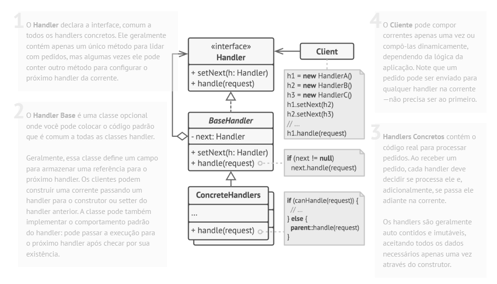

# Padrão comportamental Chain of Responsibility

## O que é

Chain of Responsibility é um padrão comportamental que tem como foco passar uma solicitação por uma cadeia de objetos, permitindo que vários objetos tenham a chance de tratá-la, sem que o remetente saiba qual objeto irá processá-la.

## Funcionamento

"O padrão Chain of Responsibility permite que você passe solicitações ao longo de uma cadeia de manipuladores. Ao receber uma solicitação, cada manipulador decide se processa o pedido ou se o passa adiante na cadeia."

Basicamente, a requisição percorre uma sequência de handlers. Cada um pode:
- Tratar a requisição
- Ou repassá-la para o próximo da cadeia

## Componentes

### Handler
Define a interface comum para todos os manipuladores da cadeia.  
Normalmente possui um método para definir o próximo handler.

### ConcreteHandler
Implementa o Handler e contém a lógica para tratar a requisição ou encaminhá-la para o próximo objeto da cadeia.

### Client
Cria a requisição e a envia para o primeiro objeto da cadeia, sem saber qual handler irá tratá-la.

## Vantagens e desvantagens

### Vantagens
- Reduz o acoplamento entre remetente e receptor
- Princípio aberto/fechado
- Princípio da responsabilidade única

### Desvantagens
- A requisição pode não ser tratada por nenhum handler
- Pode impactar o desempenho em cadeias muito longas

## Referências
[Refactoring Guru](https://refactoring.guru/pt-br/design-patterns/chain-of-responsibility)
