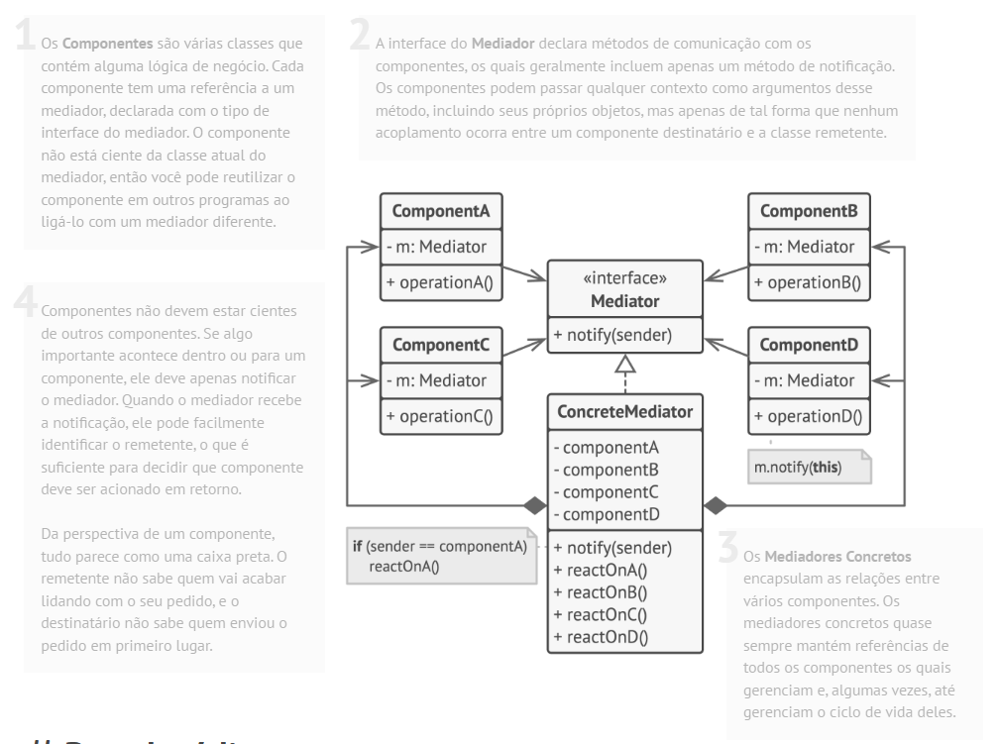

# Padrão comportamental Mediator

## O que é

Mediator é um padrão comportamental que tem como foco reduzir o acoplamento entre objetos, centralizando a comunicação entre eles em um único objeto mediador.

## Funcionamento

"O padrão Mediator permite que você reduza dependências caóticas entre objetos. O padrão restringe a comunicação direta entre os objetos e os força a colaborar apenas por meio de um objeto mediador."

Basicamente, em vez de os objetos se comunicarem diretamente entre si, eles enviam mensagens ao Mediator, que coordena e controla as interações.

## Componentes

### Mediator
Define a interface para comunicação entre os componentes.

### ConcreteMediator
Implementa a lógica de comunicação e coordena as interações entre os componentes.

### Component
Define a interface comum para os objetos que se comunicam através do mediator.

### ConcreteComponent
Implementa o Component e envia notificações ao mediator quando seu estado muda.

### Client
Cria e configura os objetos e o mediator.

## Vantagens e desvantagens

### Vantagens

- Reduz o acoplamento entre os componentes
- Centraliza a lógica de comunicação
- Facilita a manutenção e evolução do sistema
- Princípio da responsabilidade única
- Princípio aberto/fechado

### Desvantagens

- O mediator pode se tornar muito complexo
- Pode virar um “objeto deus”
- Dificulta a compreensão do fluxo de comunicação

## Referências
[Refactoring Guru](https://refactoring.guru/pt-br/design-patterns/mediator)
