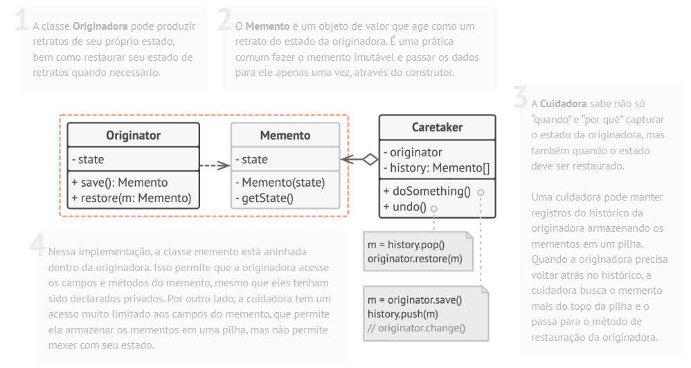

# Padrão comportamental Memento

## O que é

Memento é um padrão comportamental que tem como foco capturar e restaurar o estado interno de um objeto, sem violar o princípio de encapsulamento.

## Funcionamento

"O padrão Memento permite que você salve e restaure o estado anterior de um objeto sem revelar os detalhes de sua implementação."

Basicamente, o Memento cria uma cópia do estado de um objeto em um momento específico, permitindo que esse estado seja restaurado posteriormente, como em funcionalidades de desfazer (undo).

## Componentes

### Memento
Armazena o estado interno do objeto.  
Não permite acesso direto ao seu conteúdo por outros objetos.

### Originator
É o objeto cujo estado precisa ser salvo ou restaurado.  
Cria e utiliza o memento para guardar seu estado.

### Caretaker
É responsável por guardar os mementos, sem modificar ou acessar seu conteúdo.

### Client
Dispara as operações de salvar ou restaurar estado.

## Vantagens e desvantagens

### Vantagens

- Preserva o encapsulamento do objeto
- Permite implementar funcionalidades de desfazer (undo)
- Simplifica a recuperação de estados anteriores
- Princípio da responsabilidade única

### Desvantagens

- Pode consumir muita memória
- Pode impactar o desempenho
- Dificulta o gerenciamento de muitos estados salvos
- Não é ideal para objetos muito grandes

## Referências
[Refactoring Guru](https://refactoring.guru/pt-br/design-patterns/memento)
