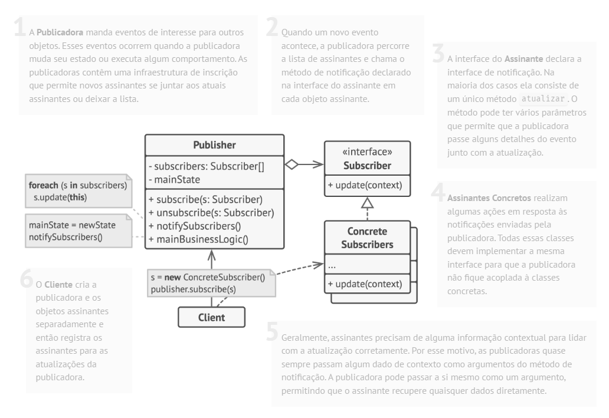

# Padrão comportamental Observer

## O que é

Observer é um padrão comportamental que tem como foco definir uma dependência um-para-muitos entre objetos, de modo que, quando um objeto muda de estado, todos os seus dependentes sejam notificados automaticamente.

## Funcionamento

"O padrão Observer permite que você defina um mecanismo de assinatura para notificar múltiplos objetos sobre quaisquer eventos que aconteçam com o objeto que eles estão observando."

Basicamente, os objetos Observers se registram em um Subject.  
Quando o Subject sofre alguma mudança, ele notifica todos os observers cadastrados.

## Componentes

### Subject
Define a interface para registrar, remover e notificar observers.

### ConcreteSubject
Implementa o Subject e mantém o estado que será observado.

### Observer
Define a interface de notificação que os observers devem implementar.

### ConcreteObserver
Implementa o Observer e reage às mudanças do subject.

### Client
Cria e configura os subjects e observers.

## Vantagens e desvantagens

### Vantagens

- Baixo acoplamento entre subject e observers
- Segue o Princípio aberto/fechado
- Segue o Princípio da responsabilidade única

### Desvantagens

- Observers podem ser notificados em ordem inesperada
- Pode causar problemas de desempenho com muitos observers

## Referências
[Refactoring Guru](https://refactoring.guru/pt-br/design-patterns/observer)
