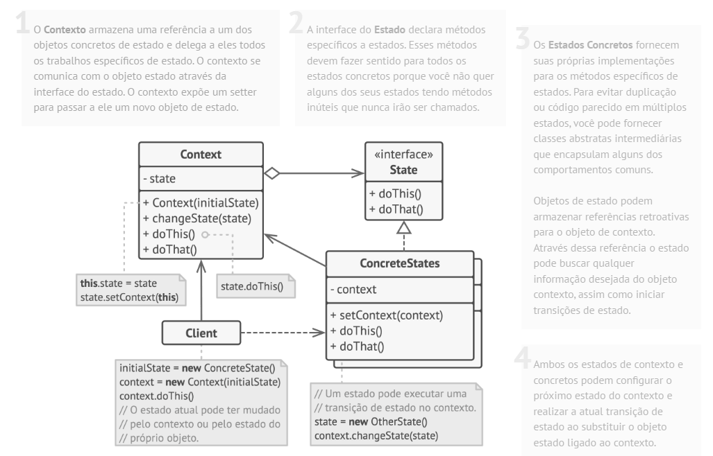

# Padrão comportamental State

## O que é

State é um padrão comportamental que tem como foco permitir que um objeto altere seu comportamento quando seu estado interno muda, como se ele trocasse de classe.

## Funcionamento

"O padrão State permite que um objeto altere seu comportamento quando seu estado interno muda. O objeto parecerá ter mudado sua classe."

Basicamente, o comportamento que varia de acordo com o estado é extraído para classes de estado separadas, e o objeto principal delega a execução para o estado atual.

## Componentes

### State
Define a interface comum para todos os estados possíveis.

### ConcreteState
Implementa o comportamento específico de um estado concreto.

### Context
Mantém uma referência para o estado atual e delega a ele as ações.

### Client
Interage com o Context, sem conhecer os detalhes dos estados concretos.

## Vantagens e desvantagens

### Vantagens

- Elimina grandes estruturas condicionais (if/else ou switch)
- Facilita a adição de novos estados
- Princípio aberto/fechado
- Princípio da responsabilidade única

### Desvantagens

- Aumenta a quantidade de classes
- Pode tornar o código mais complexo
- Pode ser excessivo para poucos estados

## Referências
[Refactoring Guru](https://refactoring.guru/pt-br/design-patterns/state)
