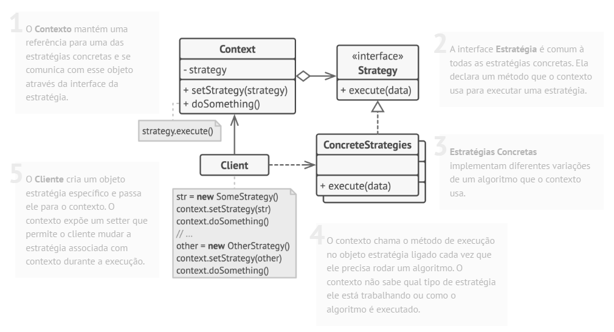

# Padrão comportamental Strategy

## O que é

Strategy é um padrão comportamental que tem como foco definir uma família de algoritmos, encapsulá-los e torná-los intercambiáveis, permitindo que o algoritmo varie independentemente do cliente que o utiliza.

## Funcionamento

"O padrão Strategy permite que você defina uma família de algoritmos, coloque cada um deles em uma classe separada e torne seus objetos intercambiáveis."

Basicamente, o comportamento que varia é extraído para classes de estratégia, e o objeto principal delega a execução para a estratégia escolhida.

## Componentes

### Strategy
Define a interface comum para todas as estratégias.

### ConcreteStrategy
Implementa um algoritmo específico seguindo a interface Strategy.

### Context
Mantém uma referência para uma estratégia e delega a ela a execução do algoritmo.

### Client
Escolhe e configura a estratégia a ser utilizada pelo Context.

## Vantagens e desvantagens

### Vantagens

- Permite trocar algoritmos em tempo de execução
- Elimina estruturas condicionais complexas
- Princípio aberto/fechado
- Princípio da responsabilidade única
- Facilita a manutenção de código

### Desvantagens

- Aumenta a quantidade de classes
- O cliente precisa conhecer as estratégias disponíveis
- Pode ser excessivo para problemas simples

## Referências
[Refactoring Guru](https://refactoring.guru/pt-br/design-patterns/strategy)
