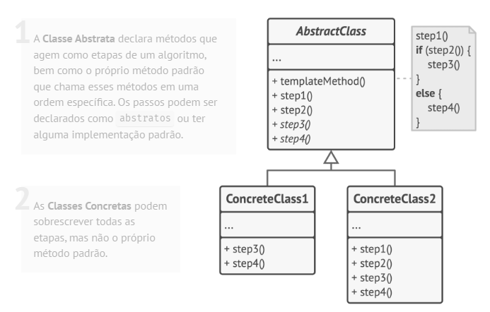

# Padrão comportamental Template Method

## O que é

Template Method é um padrão comportamental que tem como foco definir o esqueleto de um algoritmo em uma classe base, permitindo que subclasses redefinam partes específicas desse algoritmo sem alterar sua estrutura geral.

## Funcionamento

"O padrão Template Method define o esqueleto de um algoritmo na classe base, mas permite que as subclasses substituam etapas específicas do algoritmo sem alterar sua estrutura."

Basicamente, a classe base define a sequência fixa de passos, enquanto as subclasses implementam ou personalizam alguns desses passos.

## Componentes

### AbstractClass
Define o template do algoritmo, contendo o método template e etapas abstratas ou opcionais.

### ConcreteClass
Implementa os passos específicos do algoritmo definidos pela classe abstrata.

### TemplateMethod
Método que define a estrutura do algoritmo e chama os passos na ordem correta.

### Client
Utiliza o algoritmo através da classe abstrata, sem conhecer os detalhes da implementação concreta.

## Vantagens e desvantagens

### Vantagens

- Reutilização de código
- Facilita a extensão do comportamento
- Princípio aberto/fechado
- Princípio da responsabilidade única

### Desvantagens

- Pode limitar a flexibilidade das subclasses
- Pode dificultar a compreensão do fluxo do algoritmo
- Alterações na classe base afetam todas as subclasses

## Referências
[Refactoring Guru](https://refactoring.guru/pt-br/design-patterns/template-method)
