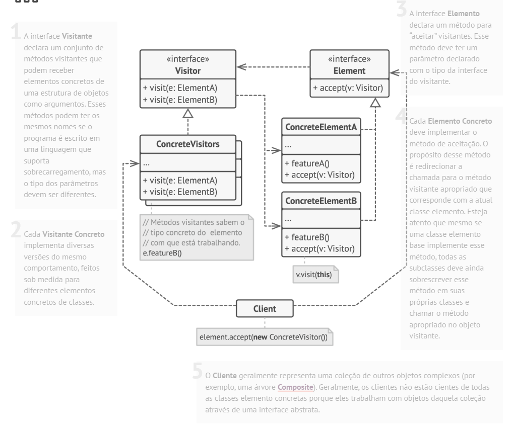

# Padrão comportamental Visitor

## O que é

Visitor é um padrão comportamental que tem como foco separar algoritmos dos objetos sobre os quais eles operam, permitindo adicionar novos comportamentos sem modificar as classes dos elementos.

## Funcionamento

"O padrão Visitor permite que você adicione novos comportamentos a uma hierarquia de classes sem alterar as classes existentes."

Basicamente, o comportamento é movido para um objeto visitante, que “visita” os elementos e executa operações específicas para cada tipo.

## Componentes

### Visitor
Define a interface com métodos de visita para cada tipo de elemento.

### ConcreteVisitor
Implementa os comportamentos específicos aplicados aos elementos.

### Element
Define a interface para aceitar um visitante.

### ConcreteElement
Implementa o Element e permite que o visitante execute operações sobre ele.

### Client
Cria e aplica os visitantes aos elementos da estrutura.

## Vantagens e desvantagens

### Vantagens

- Facilita a adição de novos comportamentos
- Segue o princípio aberto/fechado
- Centraliza operações relacionadas
- Mantém as classes de elementos simples
- Facilita a manutenção quando operações mudam com frequência

### Desvantagens

- Dificulta a adição de novos tipos de elementos
- Aumenta o acoplamento entre Visitor e Element
- Pode tornar o código mais complexo
- Exige atualização de todos os visitantes ao adicionar um novo elemento

## Referências
[Refactoring Guru](https://refactoring.guru/pt-br/design-patterns/visitor)
