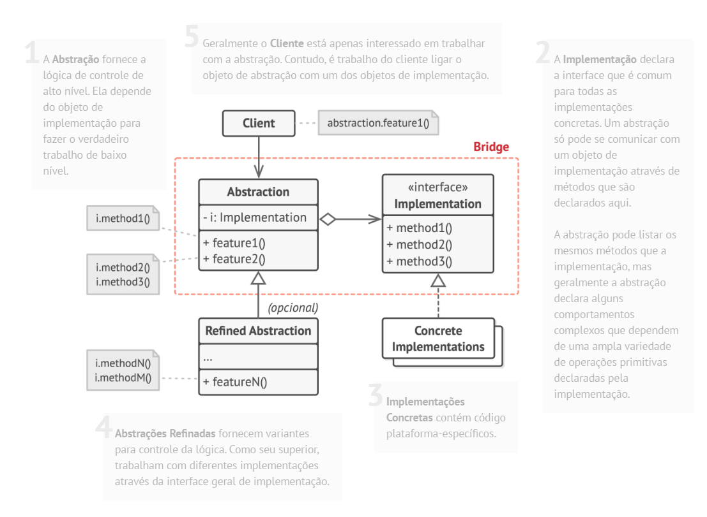

# Padrão estrutural Bridge

## O que é

Bridge é um padrão estrutural que tem como foco separar uma abstração de sua implementação, permitindo que ambas evoluam de forma independente.

## Funcionamento

"O padrão Bridge propõe a divisão de uma grande classe ou de um conjunto de classes intimamente ligadas em duas hierarquias separadas: abstração e implementação, que podem ser desenvolvidas independentemente."

Basicamente, em vez de criar várias subclasses para cada variação de comportamento, o Bridge utiliza composição, conectando a abstração a uma implementação através de uma interface.

## Componentes

### Abstraction
Define a interface de alto nível que o cliente utiliza.  
Ela mantém uma referência para a implementação.

### RefinedAbstraction
Extensão da abstração que pode adicionar ou modificar comportamentos, sem alterar a implementação.

### Implementation
Define a interface para as classes de implementação.  
Essa interface não precisa ser idêntica à abstração.

### ConcreteImplementation
Implementa a interface do Implementor, contendo a lógica concreta do funcionamento.

### Client
Utiliza a abstração sem conhecer os detalhes da implementação concreta.

## Vantagens e desvantagens

### Vantagens

- Separação entre abstração e implementação
- Princípio aberto/Fechado
- "O código cliente trabalha com abstrações em alto nível. Ele não fica exposto a detalhes de plataforma."
- Princípio da responsabilidade única.

### Desvantagens

- Aumenta a quantidade de classes
- Pode deixar o código mais complexo, principalmente se utilizado em uma classe altamente coesa.

## Referências
[Refactoring Guru](https://refactoring.guru/pt-br/design-patterns/bridge)
