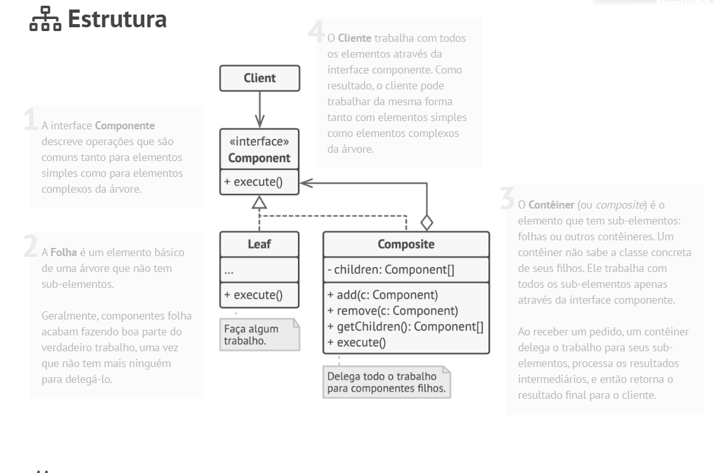

# Padrão estrutural Composite

## O que é

Composite é um padrão estrutural que tem como foco compor objetos em estruturas de árvore, permitindo que objetos individuais e composições de objetos sejam tratados de forma uniforme.

## Funcionamento

"O padrão Composite permite que você componha objetos em estruturas de árvore e então trabalhe com essas estruturas como se fossem objetos individuais."

Basicamente, o Composite faz com que o cliente não precise diferenciar se está lidando com um objeto simples (folha) ou com um conjunto de objetos (composição), pois todos seguem a mesma interface.

## Componentes

### Component
Define a interface comum para todos os objetos da estrutura, tanto simples quanto compostos.

### Leaf
Representa os objetos individuais da estrutura.  
Não possui filhos e implementa diretamente o comportamento definido pelo Component.

### Composite
Representa objetos que podem conter outros objetos (filhos).  
Ele armazena e gerencia os componentes filhos e pode delegar operações a eles.

### Client
Utiliza a interface Component para trabalhar com objetos simples ou compostos de forma transparente.

## Vantagens e desvantagens

### Vantagens

- Permite trabalhar com estruturas de árvore de forma simples
- Trata objetos individuais e composições de maneira uniforme
- Princípio aberto/fechado
- Simplificação de código

### Desvantagens

- Não é ideal quando os componentes possuem comportamentos muito diferentes

## Referências
[Refactoring Guru](https://refactoring.guru/pt-br/design-patterns/composite)
