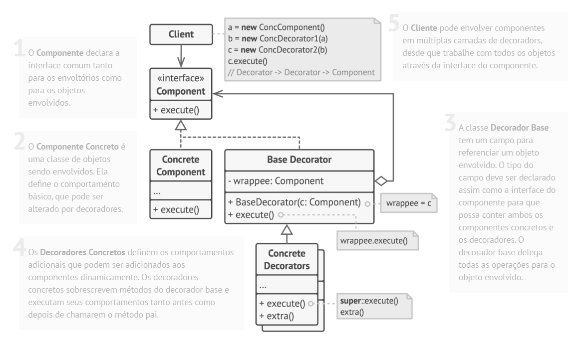

# Padrão estrutural Decorator

## O que é

Decorator é um padrão estrutural que tem como foco adicionar novos comportamentos a objetos de forma dinâmica, sem alterar sua estrutura original.

## Funcionamento

"O padrão Decorator permite que você anexe novos comportamentos a objetos colocando esses objetos dentro de objetos especiais que contêm esses comportamentos."

Basicamente, em vez de criar várias subclasses para adicionar funcionalidades, o Decorator envolve o objeto original com outros objetos que adicionam comportamentos extras.

## Componentes

### Component
Define a interface comum para os objetos que podem receber novos comportamentos.

### ConcreteComponent
Implementa o comportamento básico do objeto, que pode ser estendido pelos decorators.

### Decorator
Implementa a interface Component e mantém uma referência para um objeto Component.

### ConcreteDecorator
Adiciona novos comportamentos ao objeto, antes ou depois de delegar a chamada ao componente encapsulado.

### Client
Utiliza os objetos Component, podendo combiná-los com diferentes decorators conforme necessário.

## Vantagens e desvantagens

### Vantagens

- Permite adicionar comportamentos dinamicamente.
- Evita a criação excessiva de subclasses
- Princípio aberto/fechado
- princípio da responsabilidade única

### Desvantagens
- Pode tornar o código mais difícil de entender
- A ordem dos decorators pode afetar o comportamento
- Difícil remover um invólucro específico, já que se trata de uma pilha.

## Referências
[Refactoring Guru](https://refactoring.guru/pt-br/design-patterns/decorator)
