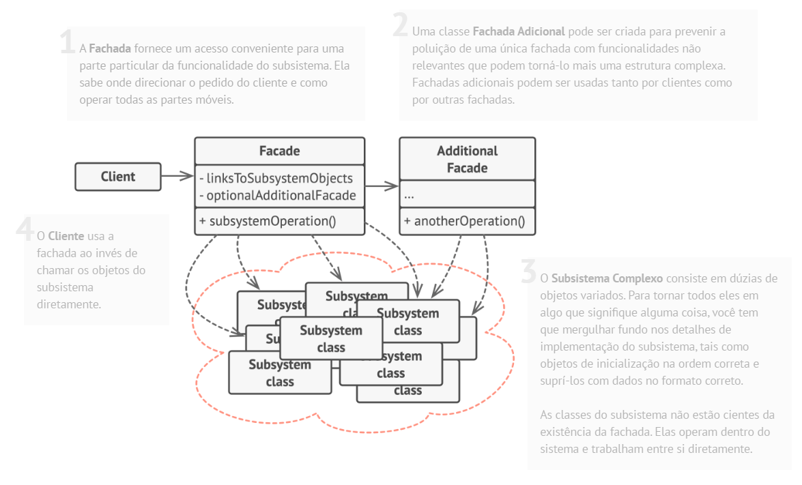

# Padrão estrutural Facade

## O que é

Facade é um padrão estrutural que tem como foco fornecer uma interface simples para um sistema complexo, escondendo sua complexidade interna.

## Funcionamento

"O padrão Facade fornece uma interface simplificada para uma biblioteca, um framework ou qualquer conjunto complexo de classes."

Basicamente, o Facade atua como uma camada intermediária, reunindo várias chamadas complexas em métodos simples, facilitando o uso do sistema pelo cliente.

## Componentes

### Facade
Fornece uma interface simples e de alto nível que o cliente utiliza para interagir com o sistema.

### Subsystem Classes
São as classes que realizam o trabalho real do sistema.  
Elas contêm a lógica complexa e não sabem da existência do Facade.

### Client
Utiliza o Facade para acessar as funcionalidades do sistema sem lidar com sua complexidade.

## Vantagens e desvantagens

### Vantagens

- Simplifica o uso de sistemas complexos
- Reduz o acoplamento entre cliente e subsistema
- Princípio de responsabilidade única
- Facilita a manutenção

### Desvantagens

- Pode se tornar uma classe muito grande, se tornadno um "objeto deus"

## Referências
[Refactoring Guru](https://refactoring.guru/pt-br/design-patterns/facade)
