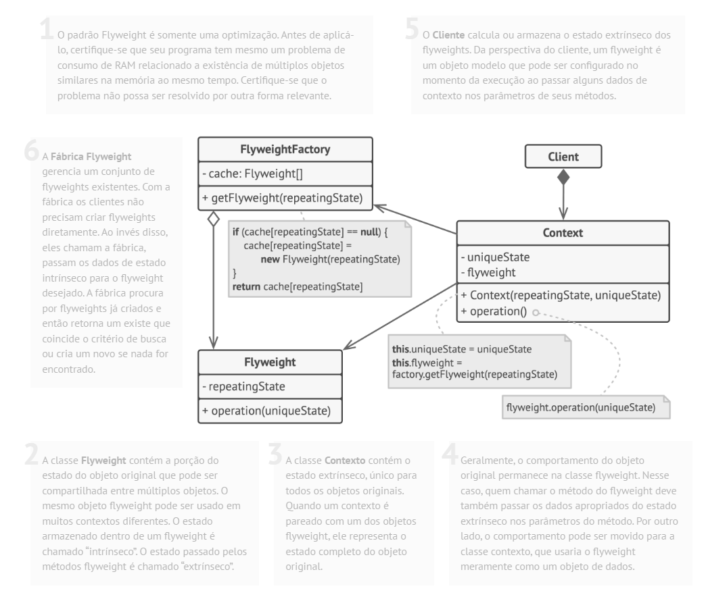

# Padrão estrutural Flyweight

## O que é

Flyweight é um padrão estrutural que tem como foco reduzir o uso de memória, compartilhando o máximo possível de dados entre objetos semelhantes.

## Funcionamento

"O padrão Flyweight permite que você coloque mais objetos na memória disponível ao compartilhar partes comuns do estado entre vários objetos, em vez de manter todos os dados em cada objeto."

Basicamente, o Flyweight separa o estado de um objeto em:
- **Estado intrínseco**: compartilhado entre vários objetos
- **Estado extrínseco**: fornecido pelo cliente conforme necessário

## Componentes

### Flyweight
Declara a interface através da qual os flyweights podem receber e agir sobre o estado extrínseco.

### ConcreteFlyweight
Implementa a interface Flyweight e armazena o estado intrínseco que pode ser compartilhado.

### FlyweightFactory
Cria e gerencia os objetos flyweight, garantindo que eles sejam reutilizados quando possível.

### Client
Mantém ou calcula o estado extrínseco e o passa para o flyweight quando necessário.

## Vantagens e desvantagens

### Vantagens

- Reduz significativamente o uso de memória
- Permite lidar com grandes quantidades de objetos
- Melhora o desempenho em sistemas com muitos objetos semelhantes

### Desvantagens

- Aumenta a complexidade do código
- Pode não valer a pena para sistemas pequenos
- Pode dificultar a leitura e manutenção do código

## Referências
[Refactoring Guru](https://refactoring.guru/pt-br/design-patterns/flyweight)
