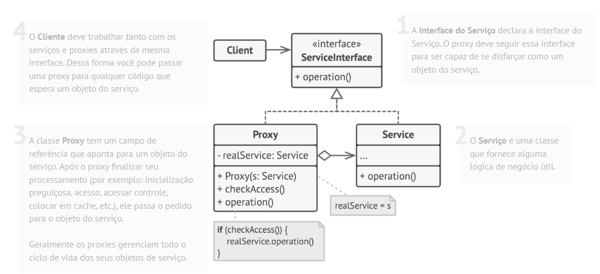

# Padrão estrutural Proxy

## O que é

Proxy é um padrão estrutural que tem como foco fornecer um substituto ou intermediário para outro objeto, controlando o acesso a ele.

## Funcionamento

"O padrão Proxy permite que você forneça um objeto substituto que controla o acesso a outro objeto."

Basicamente, o Proxy atua como um representante do objeto real, podendo adicionar comportamentos extras como controle de acesso, cache, inicialização tardia ou registro de chamadas, sem alterar o objeto original.

## Componentes

### ServiceInterface
Define a interface comum tanto para o Proxy quanto para o objeto real.

### Service
É o objeto real que contém a lógica principal do sistema.

### Proxy
Implementa a mesma interface do Subject e mantém uma referência para o RealSubject, controlando o acesso a ele.

### Client
Interage com o objeto através da interface Subject, sem saber se está lidando com um Proxy ou com o objeto real.

## Vantagens e desvantagens

### Vantagens

- Permite inicialização sob demanda (lazy initialization)
- Pode melhorar o desempenho com cache
- Princípio aberto/fechado
- Aumenta a segurança e o controle

### Desvantagens

- Aumenta a complexidade do código
- Pode introduzir atraso nas requisições

## Referências
[Refactoring Guru](https://refactoring.guru/pt-br/design-patterns/proxy)
